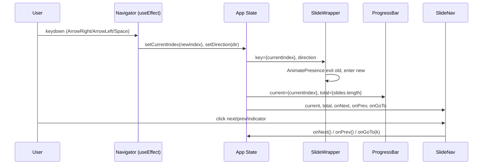

# Design Document — Kiro Presentation

## Overview

Aplicação web single-page de slides interativos sobre Inteligência Artificial e Kiro, direcionada ao time de sustentação da Cogna/Voomp. O sistema é implementado como uma apresentação baseada em React com navegação por teclado e botões, transições animadas via Framer Motion, e identidade visual do Kiro.

A arquitetura segue o padrão estabelecido pelo repositório `sentry-cogna-voomp`: componentes de slide individuais compostos por um App root, subsistema de navegação stateful, e componentes de UI reutilizáveis para layout e chrome da apresentação.

### Decisões de Design

| Decisão | Escolha | Justificativa |
|---------|---------|---------------|
| Framework | React 19 + TypeScript | Compatibilidade com stack existente da Voomp |
| Animações | Framer Motion (AnimatePresence + motion.div) | API declarativa para animações direcionais com spring physics |
| Estilização | Tailwind CSS v4 com @theme tokens | Tokens centralizados, utilitários composáveis, zero CSS customizado |
| Ícones | Lucide React | Consistente com sentry-cogna-voomp, tree-shakeable |
| Build | Vite (porta 3002) | Fast HMR, ESBuild bundling |
| Navegação | useState + useEffect keydown | Simplicidade — sem necessidade de routing library |

---

## Architecture

### Diagrama de Alto Nível

```mermaid
graph TD
    subgraph Browser
        HTML[index.html<br/>lang=pt-BR, Google Fonts]
        CSS[src/index.css<br/>@theme tokens]
    end

    subgraph App[src/App.tsx]
        STATE[Navigation State<br/>currentIndex, direction]
        SLIDES_ARRAY[slides: SlideComponent[]]
        NAV_LOGIC[Navigator Logic<br/>useEffect keydown]
    end

    subgraph UI[src/ui/]
        PB[ProgressBar]
        SN[SlideNav]
        SW[SlideWrapper]
    end

    subgraph Slides[src/slides/]
        S01[01-Capa.tsx]
        S02[02-EvolucaoIA.tsx]
        S03[03-Tokens.tsx]
        S04[04-LLMs.tsx]
        S05[05-Embeddings.tsx]
        S06[06-ContextWindow.tsx]
        S07[07-IntroKiro.tsx]
        S08[08-Steerings.tsx]
        S09[09-Skills.tsx]
        S10[10-AgentHooks.tsx]
        S11[11-Encerramento.tsx]
    end

    HTML --> App
    CSS --> App
    App --> UI
    App --> Slides
    NAV_LOGIC --> STATE
    STATE --> PB
    STATE --> SN
    STATE --> SW
    SW --> Slides
```

### Fluxo de Dados



---

## Components and Interfaces

### App (`src/App.tsx`)

Componente raiz. Gerencia todo o estado de navegação e compõe os slides com o chrome de UI.

```typescript
// src/App.tsx
import { useState, useEffect, useCallback } from 'react';
import { AnimatePresence } from 'framer-motion';

type Direction = 'next' | 'prev';

interface AppState {
  currentIndex: number;   // 0-based internally, displayed as 1-based
  direction: Direction;
}

// Array ordenado de componentes de slide
const slides: React.FC[] = [
  Capa,
  EvolucaoIA,
  Tokens,
  LLMs,
  Embeddings,
  ContextWindow,
  IntroKiro,
  Steerings,
  Skills,
  AgentHooks,
  Encerramento,
];

export default function App() {
  const [currentIndex, setCurrentIndex] = useState(0);
  const [direction, setDirection] = useState<Direction>('next');

  const goTo = useCallback((index: number) => {
    if (index < 0 || index >= slides.length) return;
    setDirection(index > currentIndex ? 'next' : 'prev');
    setCurrentIndex(index);
  }, [currentIndex]);

  const next = useCallback(() => goTo(currentIndex + 1), [currentIndex, goTo]);
  const prev = useCallback(() => goTo(currentIndex - 1), [currentIndex, goTo]);

  // Navigator subsystem — keyboard listener
  useEffect(() => {
    const handler = (e: KeyboardEvent) => {
      if (e.key === 'ArrowRight' || e.key === ' ') next();
      if (e.key === 'ArrowLeft') prev();
    };
    window.addEventListener('keydown', handler);
    return () => window.removeEventListener('keydown', handler);
  }, [next, prev]);

  const CurrentSlide = slides[currentIndex];

  return (
    <div className="relative h-screen w-screen overflow-hidden bg-[var(--color-background)]">
      <ProgressBar current={currentIndex + 1} total={slides.length} />
      <AnimatePresence mode="wait" custom={direction}>
        <SlideWrapper key={currentIndex} direction={direction}>
          <CurrentSlide />
        </SlideWrapper>
      </AnimatePresence>
      <SlideNav
        current={currentIndex + 1}
        total={slides.length}
        onNext={next}
        onPrev={prev}
        onGoTo={(k) => goTo(k - 1)}
      />
    </div>
  );
}
```

---

### SlideWrapper (`src/ui/SlideWrapper.tsx`)

Wrapper de animação para slides individuais. Usa Framer Motion para transições direcionais com spring physics.

```typescript
// src/ui/SlideWrapper.tsx
import { motion } from 'framer-motion';
import type { ReactNode } from 'react';

interface SlideWrapperProps {
  children: ReactNode;
  direction: 'next' | 'prev';
}

const variants = {
  enter: (direction: 'next' | 'prev') => ({
    x: direction === 'next' ? '100%' : '-100%',
    opacity: 1,
  }),
  center: {
    x: '0%',
    opacity: 1,
  },
  exit: (direction: 'next' | 'prev') => ({
    x: direction === 'next' ? '-100%' : '100%',
    opacity: 1,
  }),
};

const transition = {
  type: 'spring',
  stiffness: 300,
  damping: 30,
};

export function SlideWrapper({ children, direction }: SlideWrapperProps) {
  return (
    <motion.div
      custom={direction}
      variants={variants}
      initial="enter"
      animate="center"
      exit="exit"
      transition={transition}
      className="absolute inset-0 flex items-center justify-center p-8"
    >
      {children}
    </motion.div>
  );
}
```

---

### ProgressBar (`src/ui/ProgressBar.tsx`)

Barra de progresso no topo da tela. Preenchimento proporcional ao slide atual.

```typescript
// src/ui/ProgressBar.tsx
interface ProgressBarProps {
  current: number; // 1-based
  total: number;
}

export function ProgressBar({ current, total }: ProgressBarProps) {
  const percentage = (current / total) * 100;

  return (
    <div className="fixed top-0 left-0 z-50 h-1 w-full bg-white/10">
      <div
        className="h-full bg-[var(--color-primary)] transition-all duration-300"
        style={{ width: `${percentage}%` }}
      />
    </div>
  );
}
```

---

### SlideNav (`src/ui/SlideNav.tsx`)

Controles de navegação com botões anterior/próximo, indicadores de posição, e display de contagem.

```typescript
// src/ui/SlideNav.tsx
import { ChevronLeft, ChevronRight } from 'lucide-react';

interface SlideNavProps {
  current: number;  // 1-based
  total: number;
  onNext: () => void;
  onPrev: () => void;
  onGoTo: (index: number) => void; // 1-based
}

export function SlideNav({ current, total, onNext, onPrev, onGoTo }: SlideNavProps) {
  return (
    <nav className="fixed bottom-6 left-1/2 z-50 -translate-x-1/2 flex items-center gap-3 rounded-full bg-white/5 backdrop-blur-md border border-white/10 px-4 py-2">
      <button
        onClick={onPrev}
        disabled={current === 1}
        aria-label="Slide anterior"
        className="p-1 disabled:opacity-30 hover:text-[var(--color-primary)] focus:outline-2 focus:outline-[var(--color-primary)]"
      >
        <ChevronLeft size={20} />
      </button>

      <div className="flex items-center gap-1.5">
        {Array.from({ length: total }, (_, i) => (
          <button
            key={i}
            onClick={() => onGoTo(i + 1)}
            aria-label={`Ir para slide ${i + 1}`}
            className={`h-2 w-2 rounded-full transition-all focus:outline-2 focus:outline-[var(--color-primary)] ${
              i + 1 === current
                ? 'bg-[var(--color-primary)] scale-125'
                : 'bg-white/30 hover:bg-white/50'
            }`}
          />
        ))}
      </div>

      <span className="text-xs text-[var(--color-text)]/70 min-w-[3ch] text-center">
        {current}/{total}
      </span>

      <button
        onClick={onNext}
        disabled={current === total}
        aria-label="Próximo slide"
        className="p-1 disabled:opacity-30 hover:text-[var(--color-primary)] focus:outline-2 focus:outline-[var(--color-primary)]"
      >
        <ChevronRight size={20} />
      </button>
    </nav>
  );
}
```

---

### Slide Components (`src/slides/*.tsx`)

Cada slide é um componente React funcional sem props. Eles recebem layout do `SlideWrapper` e utilizam classes do Tailwind para estilização interna.

```typescript
// Exemplo: src/slides/01-Capa.tsx
import { motion } from 'framer-motion';

const stagger = {
  hidden: {},
  show: { transition: { staggerChildren: 0.15 } },
};

const fadeUp = {
  hidden: { opacity: 0, y: 20 },
  show: { opacity: 1, y: 0, transition: { duration: 0.5 } },
};

export function Capa() {
  return (
    <motion.div
      variants={stagger}
      initial="hidden"
      animate="show"
      className="flex flex-col items-center text-center gap-6"
    >
      <motion.img variants={fadeUp} src="/kiro-logo.svg" alt="Kiro" className="w-24" />
      <motion.h1 variants={fadeUp} className="text-4xl md:text-6xl font-extrabold bg-gradient-to-r from-[var(--color-primary)] to-[var(--color-accent)] bg-clip-text text-transparent">
        IA & Kiro
      </motion.h1>
      <motion.p variants={fadeUp} className="text-lg md:text-xl text-[var(--color-text)]/80">
        Tudo que o time de sustentação precisa saber
      </motion.p>
      <motion.span variants={fadeUp} className="text-sm text-[var(--color-text)]/50">
        Cogna · Voomp
      </motion.span>
    </motion.div>
  );
}
```

#### Padrão de Glassmorphism para Cards

```typescript
// Card utilitário usado dentro dos slides
function GlassCard({ children }: { children: React.ReactNode }) {
  return (
    <div className="rounded-2xl bg-[var(--color-surface)]/60 backdrop-blur-lg border border-white/15 p-6 shadow-[0_0_30px_var(--color-primary)/10]">
      {children}
    </div>
  );
}
```

---

## Data Models

### Navigation State

```typescript
interface NavigationState {
  currentIndex: number;  // 0-based, range: [0, slides.length - 1]
  direction: 'next' | 'prev';
}
```

### Slide Registry

```typescript
// O array de slides é a "fonte de verdade" para ordem e total
const slides: React.FC[] = [/* ... */];
// slides.length é o total (N)
// currentIndex mapeia para slides[currentIndex]
```

### Theme Tokens (CSS Custom Properties)

```css
/* src/index.css */
@import "tailwindcss";

@theme {
  --color-primary: #6366f1;      /* Indigo — cor principal Kiro */
  --color-accent: #a78bfa;       /* Violet — destaque secundário */
  --color-surface: #1a1a2e;      /* Superfície de cards */
  --color-text: #e8e8f0;         /* Texto padrão */
  --color-background: #09090f;   /* Fundo base */
  --font-sans: 'Inter', system-ui, sans-serif;
}
```

### File Structure

```
kiro-tour-voomp/
├── index.html                    # lang="pt-BR", Google Fonts Inter, <title>
├── package.json                  # React 19, framer-motion, lucide-react, tailwindcss v4
├── vite.config.ts                # server.port: 3002
├── tailwind.config.ts            # (minimal — v4 usa @theme em CSS)
├── tsconfig.json
├── public/
│   └── kiro-logo.svg             # Logo do Kiro
├── src/
│   ├── index.css                 # @theme tokens, @import "tailwindcss"
│   ├── main.tsx                  # ReactDOM.createRoot entry
│   ├── App.tsx                   # State, Navigator, composition
│   ├── ui/
│   │   ├── SlideWrapper.tsx      # Framer Motion animated wrapper
│   │   ├── ProgressBar.tsx       # Top progress bar
│   │   └── SlideNav.tsx          # Bottom navigation controls
│   └── slides/
│       ├── 01-Capa.tsx
│       ├── 02-EvolucaoIA.tsx
│       ├── 03-Tokens.tsx
│       ├── 04-LLMs.tsx
│       ├── 05-Embeddings.tsx
│       ├── 06-ContextWindow.tsx
│       ├── 07-IntroKiro.tsx
│       ├── 08-Steerings.tsx
│       ├── 09-Skills.tsx
│       ├── 10-AgentHooks.tsx
│       └── 11-Encerramento.tsx
└── .kiro/
    └── specs/
        └── kiro-presentation/
            ├── .config.kiro
            ├── requirements.md
            └── design.md
```

---


## Correctness Properties

*A property is a characteristic or behavior that should hold true across all valid executions of a system — essentially, a formal statement about what the system should do. Properties serve as the bridge between human-readable specifications and machine-verifiable correctness guarantees.*

### Property 1: Bounded Navigation Increment/Decrement

*For any* slides array of length N and any current index `i` in [0, N-1]:
- If `i < N-1`, calling `next()` SHALL produce `currentIndex === i + 1`
- If `i === N-1`, calling `next()` SHALL leave `currentIndex === i` (no-op)
- If `i > 0`, calling `prev()` SHALL produce `currentIndex === i - 1`
- If `i === 0`, calling `prev()` SHALL leave `currentIndex === i` (no-op)

**Validates: Requirements 1.2, 1.3, 1.4, 1.5, 1.7, 1.8**

### Property 2: Direct Navigation (goTo)

*For any* slides array of length N and any target index `k` in [0, N-1], calling `goTo(k)` SHALL set `currentIndex` to exactly `k`. For any `k < 0` or `k >= N`, `goTo(k)` SHALL leave `currentIndex` unchanged.

**Validates: Requirements 1.6**

### Property 3: Direction Tracking

*For any* navigation from index `i` to index `j` where `i !== j`:
- If `j > i`, `direction` SHALL be `"next"`
- If `j < i`, `direction` SHALL be `"prev"`

**Validates: Requirements 2.1, 2.2, 2.3, 2.4, 2.5**

### Property 4: Progress Calculation

*For any* `current` in [1, N] and `total` N > 0, the progress percentage SHALL equal `(current / total) * 100`. The minimum value (at slide 1) SHALL be `(1/N) * 100` and the maximum (at slide N) SHALL be exactly `100`.

**Validates: Requirements 1.9**

### Property 5: Accessibility Attributes

*For any* rendered slide in the presentation:
- All `` elements SHALL have a non-empty `alt` attribute
- All `<button>` elements in navigation components SHALL have either a non-empty `aria-label` attribute or non-empty visible text content

**Validates: Requirements 13.2, 13.3**

### Property 6: Color Contrast Compliance

*For any* text/background color pair defined by the theme tokens (`--color-text` over `--color-background`), the WCAG 2.1 relative luminance contrast ratio SHALL be ≥ 4.5:1.

**Validates: Requirements 13.5**

---

## Error Handling

### Navigation Boundary Protection

| Cenário | Comportamento |
|---------|---------------|
| `next()` no último slide | No-op — índice permanece inalterado |
| `prev()` no primeiro slide | No-op — índice permanece inalterado |
| `goTo(k)` com k fora de [0, N-1] | Early return — estado não modificado |
| Array de slides vazio | App não renderiza SlideWrapper (guard: `slides.length > 0`) |

### Keyboard Event Handling

- O handler de `keydown` verifica se o target não é um `<input>` ou `<textarea>` para evitar interferência com campos de formulário (caso futuro)
- Eventos são registrados e removidos via cleanup function do `useEffect`
- Apenas as teclas `ArrowRight`, `ArrowLeft` e `Space` são tratadas; todas as demais são ignoradas

### Animation State

- `AnimatePresence mode="wait"` garante que a animação de saída completa antes da entrada começar — não há estado de sobreposição
- O `key` prop no `SlideWrapper` força unmount/remount, garantindo que animações nunca ficam "presas" em estado intermediário

### Asset Loading

- O logo Kiro é servido de `/public/` como SVG estático — sem dependência de CDN
- Google Fonts é carregado via `<link>` com `display=swap` para evitar FOIT (Flash of Invisible Text)

---

## Testing Strategy

### Abordagem Dual: Unit Tests + Property Tests

**Vitest** como test runner (já alinhado com Vite), **fast-check** como library de property-based testing, **@testing-library/react** para component rendering.

### Unit Tests (Example-Based)

Foco em cenários específicos e verificação de conteúdo:

| Área | Testes |
|------|--------|
| Animation Variants | Verificar que `variants.enter('next')` retorna `{ x: '100%', opacity: 1 }` |
| Animation Variants | Verificar que `variants.exit('prev')` retorna `{ x: '100%', opacity: 1 }` |
| Transition Config | Verificar `type: 'spring'`, `stiffness: 300`, `damping: 30` |
| Slide Content (Capa) | Logo Kiro com alt="Kiro", título, subtítulo, "Cogna · Voomp" |
| Slide Content (Evolução) | Marcos históricos em ordem cronológica |
| Slide Content (LLMs) | Exemplo de tokenização, explicação de embeddings |
| Slide Content (Kiro) | "Steerings", "Skills", "Agent Hooks" com definições |
| Slide Content (Hooks) | 5 tipos de eventos listados |
| Slide Content (Encerramento) | ≥ 3 tópicos, CTA, link de documentação |
| Accessibility | Responsiveness classes em headings |
| Accessibility | Focus outline ≥ 2px em buttons |

### Property-Based Tests

Cada property test executa no mínimo **100 iterações** com inputs gerados via `fast-check`.

| Property | Test Description | Tag |
|----------|-----------------|-----|
| 1 | Gerar índice aleatório e total, aplicar next()/prev(), verificar bounds | Feature: kiro-presentation, Property 1: Bounded navigation |
| 2 | Gerar índice target aleatório, aplicar goTo(), verificar resultado | Feature: kiro-presentation, Property 2: Direct navigation |
| 3 | Gerar pares (from, to) distintos, verificar direction | Feature: kiro-presentation, Property 3: Direction tracking |
| 4 | Gerar current/total aleatórios, verificar cálculo de porcentagem | Feature: kiro-presentation, Property 4: Progress calculation |
| 5 | Renderizar cada slide, verificar alt e aria-label em todos os elementos | Feature: kiro-presentation, Property 5: Accessibility attributes |
| 6 | Computar contrast ratio entre tokens de cor, verificar ≥ 4.5:1 | Feature: kiro-presentation, Property 6: Color contrast |

### Configuração

```typescript
// vitest.config.ts
import { defineConfig } from 'vitest/config';

export default defineConfig({
  test: {
    environment: 'jsdom',
    globals: true,
    setupFiles: ['./src/test-setup.ts'],
  },
});
```

```typescript
// Exemplo de property test
import { fc } from 'fast-check';
import { describe, it, expect } from 'vitest';

describe('Feature: kiro-presentation, Property 1: Bounded navigation', () => {
  it('next() increments within bounds for any valid state', () => {
    fc.assert(
      fc.property(
        fc.integer({ min: 3, max: 30 }),  // total slides
        fc.integer({ min: 0, max: 29 }),   // current index
        (total, rawIndex) => {
          const currentIndex = rawIndex % total; // ensure valid
          const result = currentIndex < total - 1 ? currentIndex + 1 : currentIndex;
          // ... test navigation logic
          expect(navigateNext(currentIndex, total)).toBe(result);
        }
      ),
      { numRuns: 100 }
    );
  });
});
```

### Dependências de Teste

```json
{
  "devDependencies": {
    "vitest": "^3.x",
    "fast-check": "^3.x",
    "@testing-library/react": "^16.x",
    "@testing-library/jest-dom": "^6.x",
    "jsdom": "^25.x"
  }
}
```
